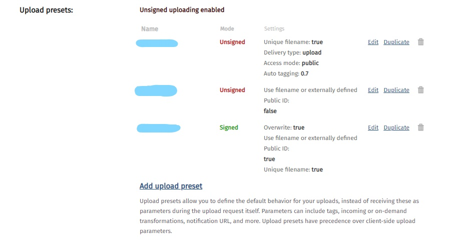

# Cloudinary Image Upload with ReactJs

and styled with TailwindCSS

## Features

1. Upload files to your Cloudinary Account.
2. Display the most recently uploaded file to the client using `cloudinary-react`

### Points to Note

1. In the `POST` request in `App.js`, change the `YOUR_UPLOAD_PRESET` to your actual upload preset which you can find in `Settings > Upload > Scroll Down` in your Cloudinary Account. This might be different depending on the Admin Dashboard. (Check the image below)

   

   If you cannot see any upload_preset such as the first one above, then you can go ahead and `Add upload preset` and follow the instructions.

2. Change `YOUR_CLOUD_NAME` with your actual cloud name which you can find in your Admin Dashboard. (Check the image below)

   

### Running the App

1. Clone the repository using `git clone` or download and extract the zip file.
2. Run `npm install` in the directory of your cloned/extracted folder.
3. Change the details above (upload_preset and cloud_name) to your actual details.
4. Run `npm run start` to start your development server on `http://localhost:3000`
